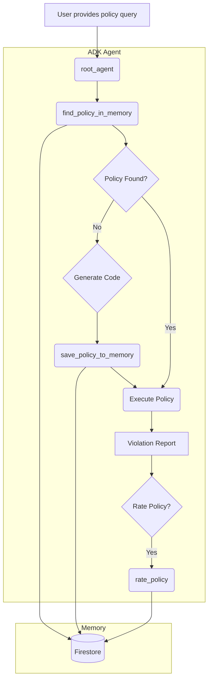

# Policy-as-Code Agent: Low-Level Details

## Architecture Overview

The Policy-as-Code Agent is designed with a "memory-first" architecture to ensure efficiency and consistency. Before generating new code, it always checks a local memory of previously generated policies.



## Component Breakdown

### 1. GCS Workflow Tools

-   **`generate_policy_code_from_gcs(query: str, gcs_uri: str)`**: An ADK tool that generates Python policy code based on a schema inferred from a GCS metadata file.
-   **`run_policy_from_gcs(policy_code: str, gcs_uri: str)`**: An ADK tool that executes the generated policy code against the metadata from the specified GCS URI.

### 2. Dataplex Search Workflow Tools

-   **`generate_policy_code_from_dataplex(policy_query: str, dataplex_query: str)`**: An ADK tool that orchestrates the first step of the live validation workflow. It connects to Dataplex, fetches a small sample of entries matching the query, infers the schema, and generates the Python policy code.
-   **`run_policy_on_dataplex(policy_code: str, dataplex_query: str)`**: An ADK tool that handles the second step. It takes the generated code, connects to Dataplex to fetch *all* entries matching the query, and executes the code against the full dataset.

### 3. Memory Components (`policy_as_code/memory.py`)

To enhance efficiency and provide a consistent user experience, the agent includes a robust memory feature for caching policies using **Google Cloud Firestore** and **Vertex AI Vector Search**.

#### Firestore Configuration
*   **Client Initialization:** The agent initializes a `google.cloud.firestore.Client` using the project ID and database name (default: `policy-agent-db`).
*   **Vector Search:** Uses `DistanceMeasure.COSINE` to find semantically similar policies.
*   **Embedding Model:** `text-embedding-004` from Vertex AI is used to generate 768-dimensional vectors for natural language queries.

#### Collections Schema

**A. `policies` Collection** (Stores reusable policy logic)
*   `policy_id` (String/UUID): Unique identifier.
*   `version` (Integer): Version number (increments on updates).
*   `query` (String): The original natural language policy query.
*   `embedding` (Vector): The vector embedding of the query.
*   `code` (String): The generated Python code.
*   `source` (String): 'gcs' or 'dataplex'.
*   `author` (String): The creator of the policy.
*   `created_at` (Timestamp): Creation time.
*   `last_used` (Timestamp): Last accessed time.
*   `ratings` (Array[Int]): User ratings (1-5).
*   `feedback` (Array[String]): User feedback comments.
*   `total_runs` (Integer): Aggregate execution count.
*   `total_violations_detected` (Integer): Aggregate violation count.

**B. `policy_executions` Collection** (Logs every run for auditing)
*   `policy_id` (String): Reference to the policy.
*   `version` (Integer): Version used.
*   `timestamp` (Timestamp): Execution time.
*   `status` (String): 'success', 'failure', or 'violations_found'.
*   `violation_count` (Integer): Number of detected violations.
*   `violated_resources` (Array[String]): List of resource names that failed.
*   `summary` (String): Brief text summary of the run.

**C. `configurations/core_policies` Document**
*   `policies` (Array[String]): List of active "Core Policy" queries.

### 4. LLM & Code Generation (`policy_as_code/utils/llm.py`)

The agent uses a sophisticated prompt engineering approach to generate accurate Python code.

*   **Prompt Template:** Located at `prompts/code_generation.md`.
*   **Dynamic Injection:**
    *   `{{USER_POLICY_QUERY}}`: The user's request.
    *   `{{INFERRED_JSON_SCHEMA}}`: A JSON schema derived from the actual metadata.
    *   `{{SAMPLE_VALUES}}`: Actual data samples extracted from the source to help the LLM understand field formats.
*   **Parsing:** The function `llm_generate_policy_code` uses regex (`r"```python\n(.*)\n```"`) to robustly extract the code block from the LLM's markdown response.

### 5. Simulation & Security (`policy_as_code/simulation.py`)

The `run_simulation` function is the secure execution engine for the agent.

*   **Step 1: Static Analysis (AST):**
    *   Uses Python's `ast` module to parse the generated code *before* execution.
    *   **Blocked Imports:** `os`, `sys`, `subprocess`, `shutil`, `requests`, `urllib`, etc.
    *   **Blocked Functions:** `eval`, `exec`, `open`, `compile`.
*   **Step 2: Restricted Execution:**
    *   Uses `exec()` with a strictly limited `globals` dictionary.
    *   **Allowed Globals:** Standard built-ins (`len`, `list`, `dict`, etc.) plus `json`, `re`, and `datetime`.
    *   **Access Control:** The code cannot access the agent's file system, network, or environment variables.

## Detailed Data Flow

1.  **User Query:** User asks, "Ensure all tables in 'finance' have a description."
2.  **Vector Search:** `find_policy_in_memory` converts this to a vector and queries Firestore.
    *   If match found (similarity > threshold): Returns cached code.
3.  **Sample Generation (If no match):**
    *   The agent scans the metadata source (GCS file or Dataplex results).
    *   It identifies the "most representative" entry (the one with the most fields) to use as a sample.
4.  **Code Generation:**
    *   Constructs the prompt with schema and sample.
    *   Calls Gemini 2.5 Pro.
    *   Extracts Python code.
5.  **Memory Save:** The new code and query embedding are saved to Firestore.
6.  **Execution:**
    *   `validate_code_safety` checks for malicious patterns.
    *   `exec()` runs the `check_policy(metadata)` function.
7.  **Reporting:** Violations are collected and returned to the user.
8.  **Logging:** The execution result is written to the `policy_executions` collection in Firestore.

## Tool Signatures

For reference, here are the signatures of the primary tools:

| Tool Name | Arguments | Description |
| :--- | :--- | :--- |
| `find_policy_in_memory` | `query` (str), `source` (str), `author` (opt), `start_date` (opt) | Vector search for existing policies. |
| `save_policy_to_memory` | `natural_language_query` (str), `policy_code` (str), `source` (str) | Saves a new policy version. |
| `llm_generate_policy_code` | `query` (str), `schema` (dict), `metadata_sample` (list) | Generates Python code via Vertex AI. |
| `run_simulation` | `policy_code` (str), `metadata` (list), `query` (str) | Safely executes the policy logic. |
| `suggest_remediation` | `violations` (list) | Generates fix suggestions using LLM. |
| `generate_compliance_scorecard` | `source_type` (str), `source_target` (str) | Runs core policies and calculates a compliance score. |
| `export_report` | `violations` (list), `format` (str), `filename` (str), `destination` (opt) | Exports violations to CSV/HTML, optionally to GCS. |
| `get_execution_history` | `days` (int), `status` (opt), `policy_id` (opt) | Retrieves logs of past policy runs. |
| `analyze_execution_history` | `query_type` (str), `days` (int), `resource_name` (opt) | Performs analysis like finding top violations or hotspots. |
| `get_active_core_policies` | None | Retrieves the list of currently active core policies. |
| `save_core_policies` | `policies` (list) | Saves a new list of core policies to memory. |