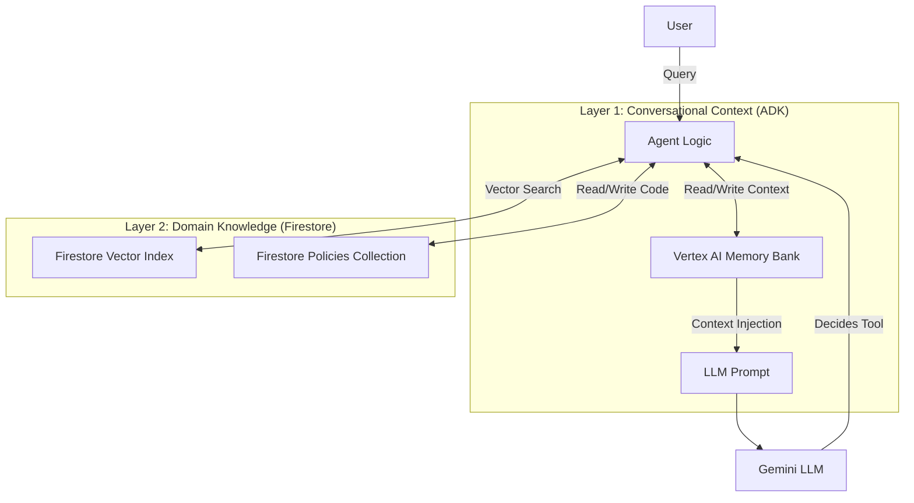

# Hybrid Memory Implementation: Agent Engine + Firestore

The Policy-as-Code Agent utilizes a **Hybrid Memory Architecture** that combines the native conversational capabilities of the Agent Engine (ADK) with a specialized, structured knowledge store built on Google Cloud Firestore.

This approach ensures the agent is both **conversationally aware** (remembering context within a chat) and **domain intelligent** (remembering complex policy logic and execution history permanently).

## The Hybrid Approach

We distinguish between two types of memory required for a robust enterprise agent:

1.  **Conversational Context (Short/Medium Term):** Handled by **Agent Engine Native Memory**.
2.  **Procedural & Semantic Knowledge (Long Term):** Handled by **Firestore + Vector Search**.

| Feature | Agent Engine Native Memory (ADK) | Firestore Custom Memory |
| :--- | :--- | :--- |
| **Primary Goal** | Maintain chat context and session history. | Store & retrieve executable policy logic (Code). |
| **Technology** | `VertexAiMemoryBankService` | Google Cloud Firestore + Vector Search |
| **Scope** | Session-based (User-specific). | Global (Shared across all users/agents). |
| **Data Type** | Unstructured text (chat logs). | Structured Documents (JSON, Vectors, Code). |
| **Example** | "I meant the *other* table." | "Here is the Python code to check for PII." |

---

## Layer 1: Conversational Context (Agent Engine Native)

The agent leverages the built-in memory capabilities of the Google Cloud Agent Engine (ADK) to handle the nuances of human conversation.

### Components
*   **`VertexAiMemoryBankService`**: The backend service that stores the session history and turns.
*   **`PreloadMemoryTool`**: A special tool injected into the agent's toolset. Before the LLM generates a response, this tool searches the session history for relevant past interactions and injects them into the prompt context.
*   **`auto_save_session_to_memory_callback`**: An asynchronous callback registered in the `Agent` definition. It ensures that every interaction (user query + agent response) is automatically persisted to the memory bank.

### How it works
When a user says, *"Run that check again but for the finance dataset"*, the Agent Engine memory provides the context of what *"that check"* refers to (e.g., the policy discussed in the previous turn). Without this, the agent would not understand the reference.

```python
# policy_as_code/agent.py

# 1. Callback to save state
async def auto_save_session_to_memory_callback(callback_context):
    await callback_context._invocation_context.memory_service.add_session_to_memory(
        callback_context._invocation_context.session)    

# 2. Agent Initialization with Memory Tool
root_agent = Agent(
    # ...
    tools=[
        # ...
        adk.tools.preload_memory_tool.PreloadMemoryTool() # <--- Injects context
    ],
    after_agent_callback=auto_save_session_to_memory_callback # <--- Saves context
)
```

---

## Layer 2: Procedural & Domain Knowledge (Firestore)

While the ADK handles *chat*, it is not designed to store executable code or complex structured data like policy versions and audit logs. For this, we implemented a custom memory layer using **Google Cloud Firestore**.

### Components
*   **`memory.py`**: A custom module that acts as the interface to Firestore.
*   **Vector Search**: Uses Vertex AI embeddings (`text-embedding-004`) to create a semantic index of all known policies.
*   **Structured Collections**:
    *   `policies`: Stores the generated Python code, the natural language query, and the vector embedding.
    *   `policy_executions`: Stores audit logs of every run.

### How it works
When a user asks for a policy, the agent doesn't just look at the chat history; it consults its "Knowledge Base."

1.  **Semantic Retrieval**: The agent embeds the user's query and searches Firestore.
2.  **Code Reuse**: If a similar policy exists (even if phrased differently), it retrieves the tested, cached Python code. This is the "Procedural Memory" — remembering *how* to do something.
3.  **Shared Knowledge**: Because Firestore is a centralized database, if User A creates a complex policy for "GDPR Compliance," User B can immediately use it without having to recreate it.

---

## The "Secret Sauce": How They Work Together

The power of this agent lies in the intersection of these two memory systems.

### Example Scenario

**User:** "Create a policy to check for PII in the customer_data table."

1.  **Firestore Memory (Action):** The agent generates the code, runs it, and saves it to Firestore as Policy ID `123-abc`.
2.  **ADK Memory (Observation):** The ADK records that the user is working on Policy `123-abc` and is interested in `customer_data`.

**User:** "Okay, now run it on the sales_data table."

1.  **ADK Memory (Retrieval):** The `PreloadMemoryTool` identifies that "it" refers to the PII policy (Policy ID `123-abc`) discussed in the previous turn.
2.  **Firestore Memory (Retrieval):** The agent uses the ID `123-abc` to fetch the executable Python code from Firestore.
3.  **Execution:** The agent applies the retrieved code to the new target (`sales_data`).

### Architecture Diagram



## Benefits of Hybrid Architecture

1.  **Cost Efficiency:** We don't waste tokens re-generating code (Firestore handles caching), and we don't overload the context window with irrelevant history (ADK memory selects only relevant turns).
2.  **Continuity:** The agent feels "smart" because it follows the conversation flow (ADK) while also being "knowledgeable" because it remembers established business rules (Firestore).
3.  **Scalability:** Conversational context is ephemeral and session-scoped, while Policy knowledge is permanent and organization-scoped. separating them allows the knowledge base to grow indefinitely without impacting chat performance.
