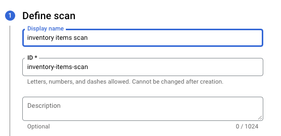
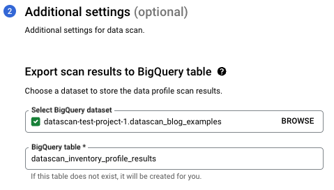
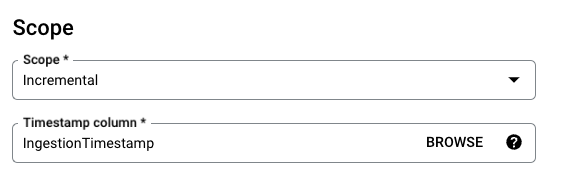
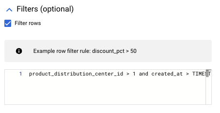
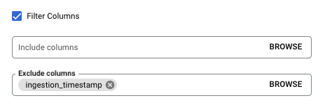

##### [How to Use Dataplex Data Profile to Unleash the Power of Your Enterprise Data](link)

Detailed instructions for setting up data profile scan for example scenario in the blog.

###### _Display Name_
Provide a descriptive name for your profile scan. Idea is to keep this as unique as possible, since this is used to auto-generate a unique ID for your profile scan. Let’s choose, `inventory items scan`. 

###### _Table to scan_
Here you can directly specify the path to your BigQuery table since your data is structured data and already organized into a BigQuery table.

###### _Scope_
Here you can specify the scope of your scan. It can either be  `Entire data`, where the profile scan runs on the whole table every single time. Or it can be `Incremental`, where each scan starts from the end of the previous scan. 

Setting the scope to `Entire data` is useful if you a) don’t intend to receive more data into the source table b) only want to run a one-off scan to just get an initial summary of the data. 

For `Incremental` scans, since the scan needs to keep a history of the last scanned row, you need to specify an unnested column from our source table of `Timestamp` or `Date` type. This should be a `Required` column with values which **monotonically** increases over time. 

Since, in this case, you expect the source table to be updated with ~200  rows every day and you are interested in tracking the insights from the table on a recurring basis, it makes sense to set the scope to `Incremental` and select the `ingestion_timestamp` column as the `Timestamp` column. 

###### _Filter rows_
You can specify a filter in the form of a SQL expression to filter the rows based on your condition. This SQL expression should be a valid expression for a WHERE clause in BigQuery standard SQL syntax. These filters will be applied every time this scan runs on the source table. 

Let’s say, the product team’s requirement is to only consider data for `distribution center id` greater than 1. So our row filter condition can be `product_distribution_center_id > 1.` 

You could also leverage row filters to filter out older data in your tables. This can be particularly useful if you have large tables with legacy data that is not particularly interesting from a monitoring perspective. Recall that the product team also wanted to ignore all the inventory data created before 2019. So an additional row filter condition can be `created_at > TIMESTAMP('2018-12-31')`.

The final row filter condition will be  `product_distribution_center_id > 1 and created_at > TIMESTAMP('2018-12-31')`

###### _Filter Columns_
Additionally, you can also filter out specific columns to be scanned by this profile scan. This is particularly useful if you have a prior knowledge of which columns will be particularly interesting to scan. 

For instance, in your case, you know that the ingestion_timestamp column is a required Timestamp column and will not provide any useful profiling information. You can filter out this column by specifying it in the excluded column list. Alternatively, you could specify the columns that you want to be included in the  profile scan in the included column list. 

Here, we will exclude the column ingestion_timestamp since we already know its values and are filtering on this column. 

