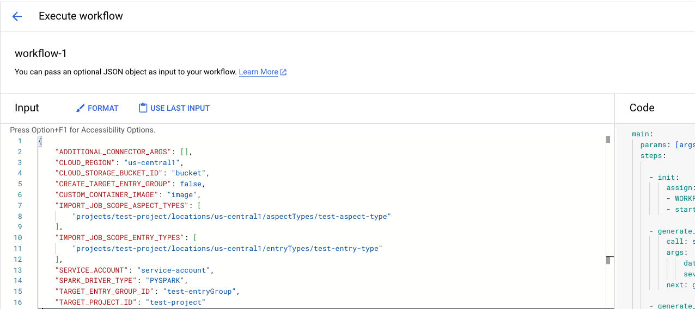

# Orchestration for Dataplex Managed Connectivity

[Dataplex Managed Connectivity](https://cloud.google.com/dataplex/docs/managed-connectivity-overview) platform provides customers a self-service experience to connect and ingest metadata from non-GCP sources into Dataplex Catalog.

This guide demonstrates how to self orchestrate the flow for Managed Connectivity. Self orchestration is achieved through a Cloud Workflow which performs the following high level steps:

1. Create target EntryGroup, if it does not exist, based on user configuration.
2. Metadata Extraction: Create Dataproc serverless batch job for connector run. 
3. Monitor the progress of the batch job.
4. Metadata Import: Trigger Dataplex Metadata Import job upon successful completion of the batch job.
5. Monitor the progress of the Import job.

## User Guide

Refer to our official guide at [Import metadata from a custom source using Workflows](https://cloud.google.com/dataplex/docs/import-using-workflows-custom-source) for more details.

### Deployment and Execution

#### Console
Go to [Cloud Workflows](https://console.cloud.google.com/workflows) to setup a new workflow.

1. To create a new Cloud Workflow, select CREATE


2. Define workflow using one of the sample template provided, example [bring your own connector template](byo-connector/templates/byo-connector.yaml)


3. To manually run your workflow, select your workflow and select EXECUTE


4. Provide your Workflow arguments in the form of json (example [bring your own connector arguments](byo-connector/args/byo-connector-workflow-args.json)).



5. To schedule your Cloud Workflow, use [Cloud Scheduler](https://console.cloud.google.com/cloudscheduler) and select CREATE JOB. Provide Scheduler Job definition and Frequency via cron expression, as well as timezone.


6. Select Target type Workflows via HTTP, your Cloud Workflow, and your Service Account. Additionally, provide your workflow arguments as well.


7. Provide any additional optional retry logic.


### gcloud
Another way to deploy the resources is through gcloud.
1. Deploy the Workflow Template and Cloud Scheduler Job using [these commands](samples/scripts/gcloud/deploy.sh).

2. Execute the Workflow Template with your desired arguments using commands in [this script](samples/scripts/gcloud/execute.sh).

#### Terraform
Refer to sample code for supplementary information.

Clone repository.
```bash
git clone <repository_url> # Replace with the actual repository URL
```
1. Choose connector and update configuration. Example [bring your own connector config](byo-connector/terraform/byo-connector.tfvars).
2. Initialize, validate, and deploy terraform with the desired terraform variables file.
```bash
terraform init
terraform plan --var-file=byo-connector.tfvars
terraform apply --var-file=byo-connector.tfvars
```
Terraform will create the following resources in the specified Google Cloud project:
1. [Cloud Scheduler](https://console.cloud.google.com/cloudscheduler) job
2. [Cloud Workflow](https://console.cloud.google.com/workflows)

Cloud Workflows will execute at the **cron_schedule** that you specify.

### Monitoring
#### Workflow output
The workflow templates emit 2 important links for monitoring in the LOGS tab in the executions UI:
1. Link to the Dataproc Serverless Batch job for metadata extraction
2. Link to Cloud logs for Dataplex Metadata Import job.
#### Import job logs in Logs Explorer
Navigate to [Cloud Logging](https://console.cloud.google.com/logs) to observe logs. Filter logs by Metadata Job monitored resource.
```
resource.type="dataplex.googleapis.com/MetadataJob"
resource.labels.location=${region}
resource.labels.metadata_job_id=${import_job_id}
```
#### Import job logs using gcloud
```bash
gcloud --project ${project_id} logging read "resource.type=dataplex.googleapis.com/MetadataJob AND
resource.labels.location=${region} AND 
resource.labels.metadata_job_id=${import_job_id}" --freshness=7d
```