# Snowflake to Dataplex Metadata Loader

### Introduction:

In today's complex data landscape, organizations increasingly recognize data as a critical asset. The ability to effectively discover, understand, and govern this data is paramount for informed decision-making, regulatory compliance, and innovation. As data ecosystems grow, spanning various platforms and technologies, maintaining a holistic view of data assets becomes challenging.

This connector addresses a key need for many enterprises: bridging the gap between their data warehousing capabilities and the comprehensive data governance and discovery features offered by Google Cloud's Dataplex. Dataplex provides a unified data fabric to manage, monitor, and govern data across diverse environments within Google Cloud.

The **Snowflake Horizon to Dataplex Universal Catalog Connector**, detailed here, is a testament to the power of seamless integration. It's designed to automate metadata synchronization, bringing the rich context of your data into dataplex. This not only enhances data visibility and accessibility for all stakeholders but also strengthens your data governance by centralizing metadata management, lineage tracking, and data quality initiatives.

We believe that by leveraging this connector, you'll unlock new levels of efficiency and empower your teams to truly become data-driven. This guide is your indispensable companion, providing clear, step-by-step instructions and practical insights for a successful implementation.

---

### Step by Step Guide:

This document will show an end to end POC of how to use Snowflake to Dataplex Universal Catalog Loader.

#### Step 1: Setting up Snowflake Environment from where you have to load the metadata. 
To access the Horizon catalog in Snowflake, you will need to use the **ACCOUNT_USAGE** views located under the **SNOWFLAKE** database.

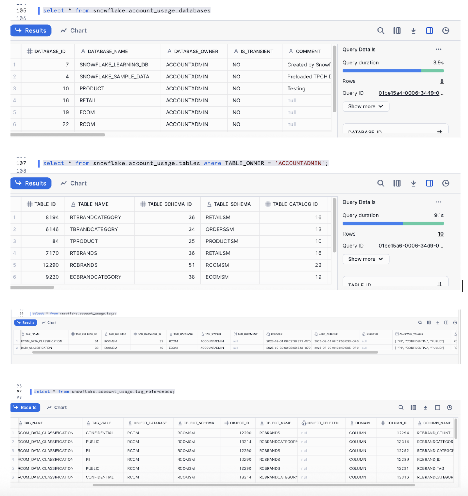

#### Step 2: Storing the connection details in Secret Manager.

In **Google Cloud Console** -> Navigate to **Secret Manager** -> **Create Secret** ->
Then you create the following 3 secrets:
* `snowflake-user-name`
* `snowflake-user-password`
* `snowflake-account-uri`

Please note that you have to create these secrets in your GCP Project.

#### Step 3: Setting up the Dataplex Universal Catalog Environment.

You will perform the following one-time setup steps in your GCP Project:

1. **Create an entry group** for the entries that you want to import. Follow the steps from [here](https://docs.cloud.google.com/dataplex/docs/ingest-custom-sources#create-entry-group) and create an entry group named **"snowflakehorizongrp"**
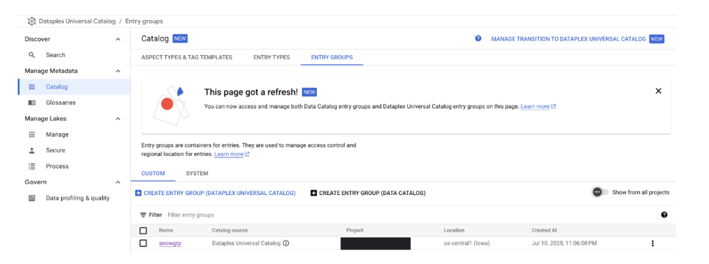

2. **Create aspect types** for the aspects that you want to import. Follow the steps from [here](https://docs.cloud.google.com/dataplex/docs/enrich-entries-metadata#create-aspect-type) and create the following aspects types: **"snowhorizondb"**, **"snowhorizonschema"**, **"snowhorizontable"**, **"snowhorizontag"**, **"snowhorizontagref"**, **"snowhorizonindex"**, **"snowhorizonfunction"**. Please note that these names are not mandatory and can be changed as per your requirements as well just that you will have to change these in the script also. If you want to use the script as it is then please use the names as mentioned above.
* Navigate to Dataplex -> Dataplex Universal Catalog -> Catalog -> "Aspect types & Tag Templates "
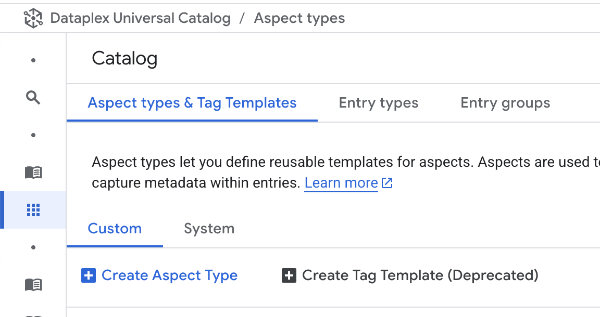
* You will see two options there as shown above:- "Custom" & "System". Under "Custom", click on "+Create Aspect Type". You will see the following screen:-
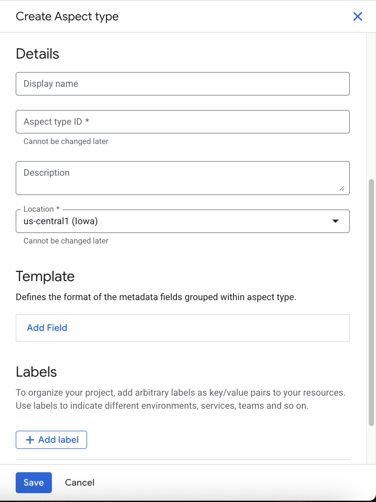
* Fill the details as below(e.g for snowhorizondb)
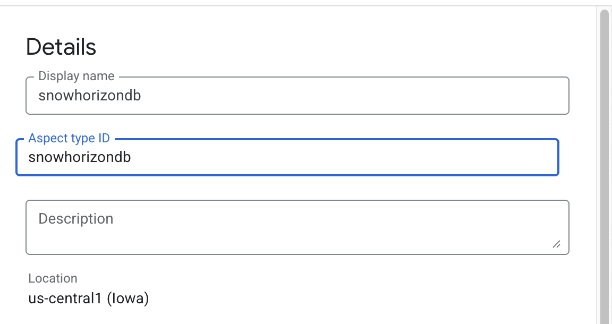
* Next, Under "Template", click on "Add Field":- 
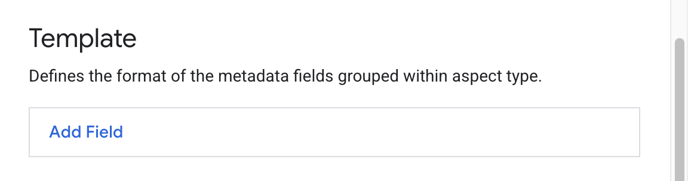
* Fill all the details related to that field(e.g DatabaseName):-
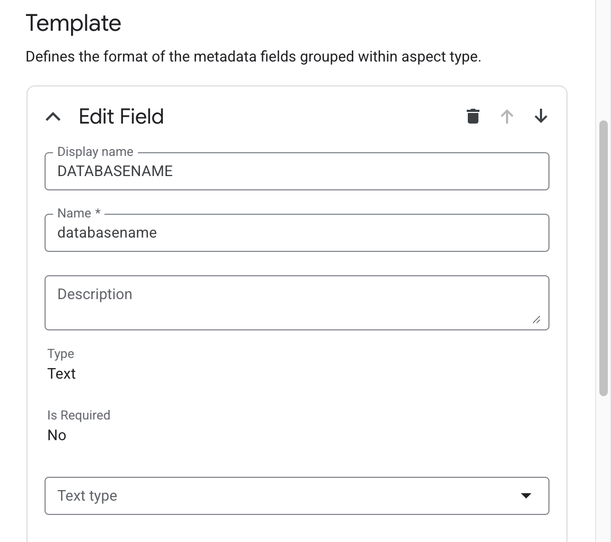
* Similarly, add all the fields(metadata that you are trying to bring from Snowflake Horizon) and click on "Save":-
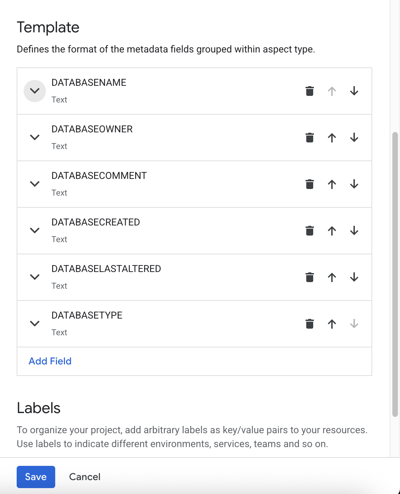
Similarly, create all the aspect types mentioned above one by one. Required Fields are mentioned in the python script for each aspect type(if you plan to execute the script as it is).
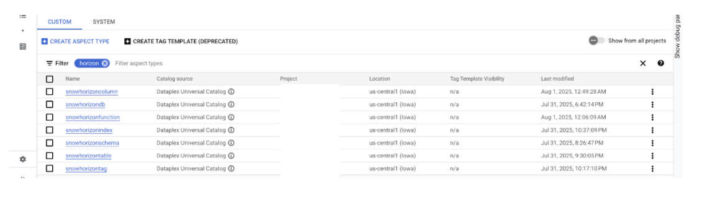

3. **Create entry types** for the entries that you want to import. Follow the steps from [here](https://docs.cloud.google.com/dataplex/docs/ingest-custom-sources#create-entry-type) and create the following entry types: **"snowhorizondb"**, **"snowhorizonschema"**, **"snowhorizontable"**, **"snowhorizontag"**, **"snowhorizontagref"**, **"snowhorizonindex"**, **"snowhorizonfunction"**. Please note that these names are not mandatory and can be changed as per your requirements as well just that you will have to change these in the script also. If you want to use the script as it is then please use the names as mentioned above.
* Navigate to Dataplex -> Dataplex Universal Catalog -> Catalog -> "Aspect types & Tag Templates "
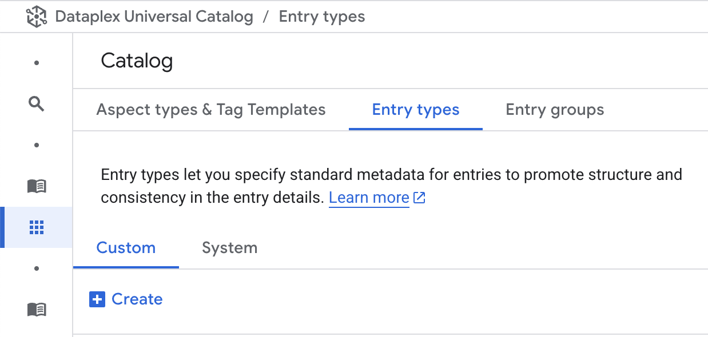
* You will see two options there as shown above:- "Custom" & "System". Under "Custom", click on "+ Create". You will see the following screen, Fill in the details as below(e.g for snowhorizondb):-
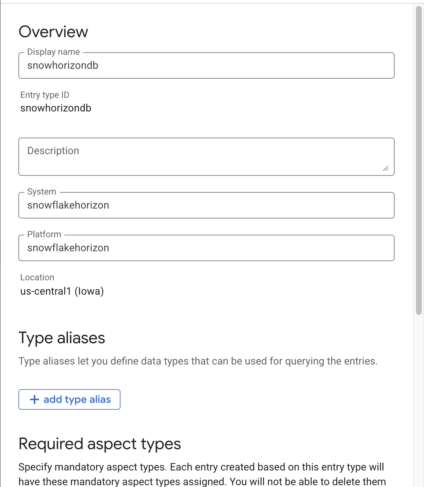
* Under, "Required Aspect Type", click on "Choose aspect type" and select the relevant aspect type as created in Step 2 and click on "Save":-
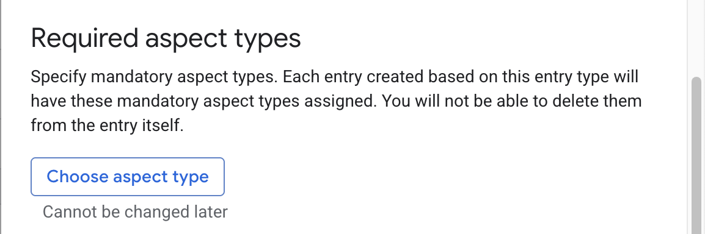
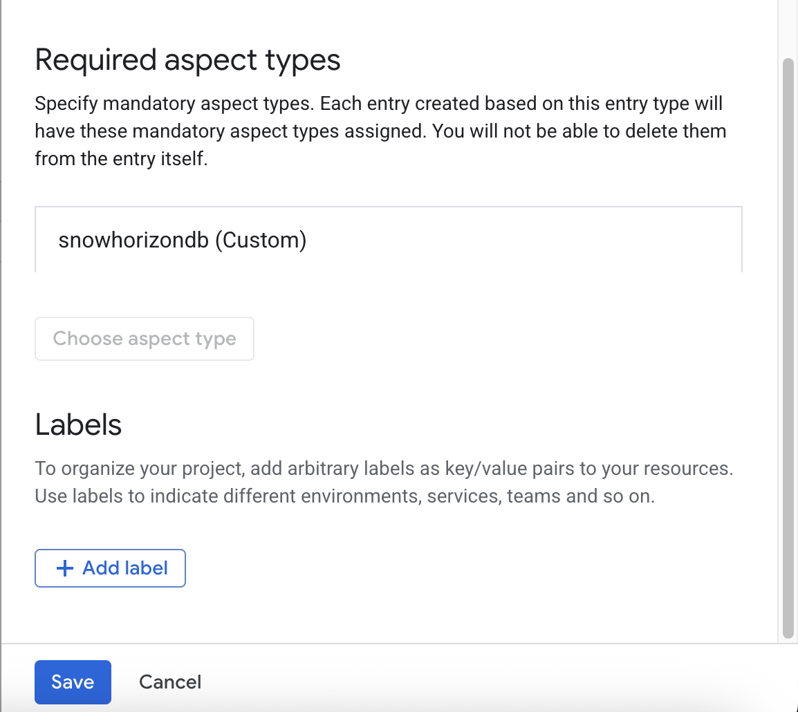
Similarly, create all the above mentioned Entry Types and attach the relevant Aspect Type (created in step 2) to it.
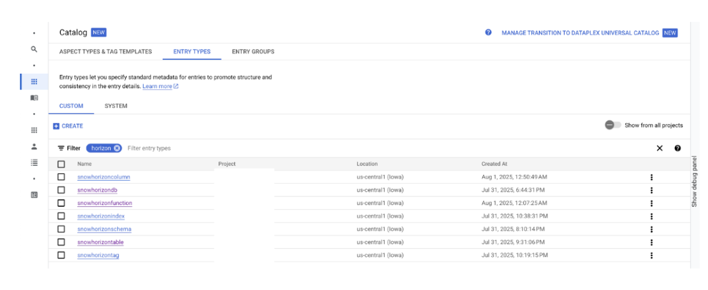

#### Step 4: Execute the Python Script to load the Horizon Metadata from Snowflake to Dataplex
Now you have to execute the Python script: `snowflake_to_dataplex_metadata_loader.py`

Before executing the script, you will have to provide the following details in the first section of the script:
* PROJECT_ID = 'Enter your Project Name'
* SNOWFLAKE_WAREHOUSE = 'Enter your Warehouse'
* SNOWFLAKE_DATABASE = 'Enter your Database'
* SNOWFLAKE_SCHEMA = 'Enter your Schema'

Also, you will need to provide the following access to the service account:-
* To read the Snowflake login credentials - Secret Manager Secret Accessor
* To create and manage the Snowflake metadata entries - Dataplex Catalog Editor

#### Step 5: Validate everything in Dataplex.
For example, you can validate Snowflake Databases as below:-

* Navigate to Dataplex -> Dataplex Universal Catalog -> Catalog -> Entry Types -> select "snowhorizondb"
* Next, click on "Sample Entries" and you will see all the Databases from Snowflake here.
* Click on any of them and validate your entries between Snowflake and Dataplex.

Similarly, you can validate all other metadata as well.